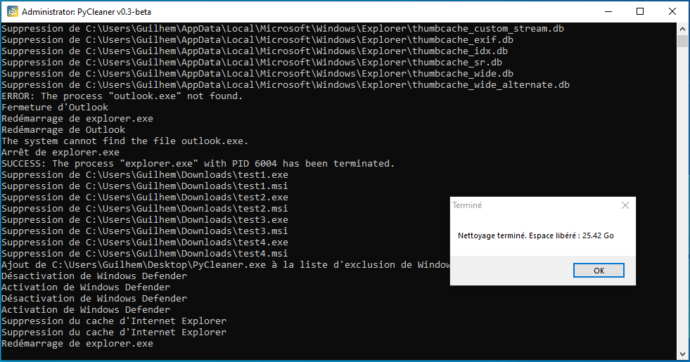

<div align="center"><H1>SweePy</H1></div>

<div align="center"></div>
</br>
SweePy est un programme Python qui permet de nettoyer votre ordinateur en supprimant les fichiers temporaires, les fichiers de mise à jour Windows, les fichiers journaux, les fichiers de rapport d'erreur, les fichiers de cache des navigateurs, les fichiers de la corbeille, les fichiers de la cache de DirectX Shader, les fichiers de la cache des miniatures, les fichiers de ressources de langue inutilisées et les fichiers de cache de courrier électronique Outlook.

## Prérequis

- Python 3.x
- Les bibliothèques Python suivantes :
  - `os`
  - `shutil`
  - `sys`
  - `ctypes`
  - `platform`
  - `glob`
  - `tkinter`
  - `winreg`
  - `win32com.client`
  - `pythoncom`

## Utilisation

1. Ouvrez une invite de commande ou un terminal.
2. Naviguez jusqu'au dossier contenant SweePy.py.
3. Installez les bibliothèques Python requises :

   ```
   pip install -r requirements.txt
   ```
4. Exécutez SweePy.py en tant qu'administrateur en utilisant la commande suivante :

   ```
   python SweePy.py
   ```

5. Suivez les instructions à l'écran pour nettoyer votre ordinateur.

INFOS: Vous pouvez utiliser l'option `--yesAll` pour passer toutes les étapes de confirmation.

## Compilation

1. Ouvrez une invite de commande ou un terminal.
2. Installer PyInstaller :

   ```
   pip install pyinstaller
   ```
3. Naviguez jusqu'au dossier contenant SweePy.py.
4. Exécutez la commande suivante :

   ```
   python3 -m PyInstaller --onefile --icon=resources/images/icon.ico --name=SweePy SweePy.py
   ```
   *Note: Vous pouvez utiliser l'option `--noconsole` pour cacher la console.*

5. Naviguez jusqu'au dossier `dist`.
6. Exécutez SweePy.exe en tant qu'administrateur.

## Fonctionnalités

### Nettoyage des fichiers temporaires (%temp%)

Supprime les fichiers temporaires stockés dans le dossier `%temp%`.

### Nettoyage des fichiers de mise à jour Windows

Supprime les fichiers de mise à jour Windows stockés dans le dossier `C:\Windows\SoftwareDistribution\Download`.

### Nettoyage des fichiers journaux

Supprime les fichiers journaux stockés dans le dossier `C:\Windows\Logs`.

### Nettoyage des fichiers de rapport d'erreur

Supprime les fichiers de rapport d'erreur stockés dans le dossier `C:\ProgramData\Microsoft\Windows\WER\ReportQueue`.

### Nettoyage des fichiers de cache des navigateurs

Supprime les fichiers de cache des navigateurs Google Chrome, Mozilla Firefox, Microsoft Edge, Internet Explorer et Opera.

### Nettoyage des fichiers de la corbeille

Vide la corbeille.

### Nettoyage des fichiers de la cache de DirectX Shader

Supprime les fichiers de la cache de DirectX Shader stockés dans le dossier `C:\Users\%username%\AppData\Local\Microsoft\DirectX Shader Cache`.

### Nettoyage des fichiers de la cache des miniatures

Supprime les fichiers de la cache des miniatures stockés dans le dossier `C:\Users\%username%\AppData\Local\Microsoft\Windows\Explorer`.

### Nettoyage des fichiers de ressources de langue inutilisées

Supprime les fichiers de ressources de langue inutilisées stockés dans le dossier `C:\Windows\WinSxS`.

### Nettoyage des fichiers de cache de courrier électronique Outlook

Supprime les fichiers de cache de courrier électronique Outlook stockés dans le dossier `C:\Users\%username%\AppData\Local\Microsoft\Outlook`.

## Avertissement

L'utilisation de SweePy est à vos risques et périls. Assurez-vous de sauvegarder vos fichiers importants avant d'utiliser SweePy. SweePy supprime des fichiers de votre ordinateur et ne peut pas être tenu responsable des pertes de données ou des dommages causés à votre système.

## Informations complémentaires

- **Version** : 0.1b
- **Licence** : MIT
- **Langage** : Python 3.x
- **Système d'exploitation** : Windows 10 & Windows 11

## Screenshots

<div align="center"></div>

## Auteur

- **[Guilhem Jéhanno](https://github.com/0xGuigui/)** - *Développeur*